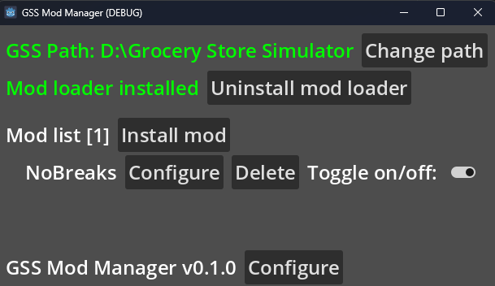

# GSS Mod Manager
Mod Manager for Grocery Store Simulator built using Godot.  
### [Download](https://github.com/nieboczek/gss-mod-manager/releases/latest)
## How to contribute
### Requirements:
- Godot 4.3.stable

Fork the repository and apply changes in Godot.  
After you're done making changes, you can make a pull request.

To test you will need the latest release, unzip it and grab 7z.exe, 7z.dll, mod folder, UE4SS folder.
Then put it into where you built your release.

# How to use
After downloading, unzip gss-mod-manager.zip to its own folder and run gss-mod-manager.exe.
Now, select your game folder (if not automatically detected).
After selecting the game folder you should see if you have installed the mod loader and if you have any mods.

When installing a mod, don't open non-mod zip files, they will be unpacked and land in your mods folder.
